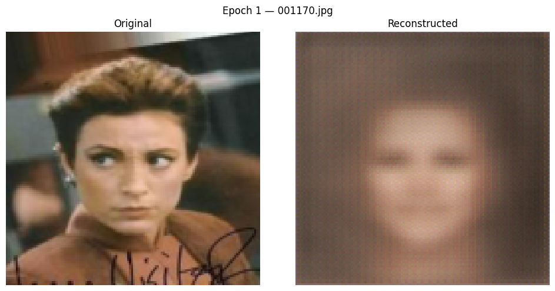
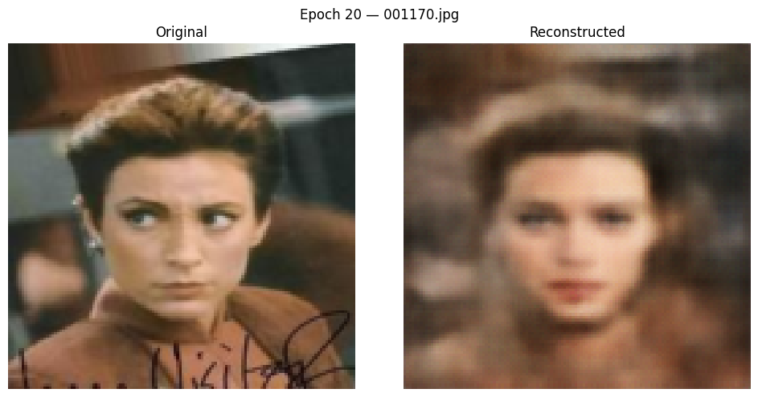
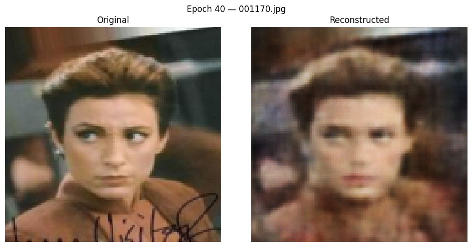
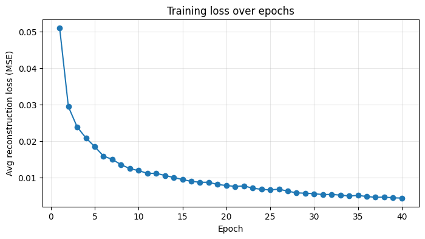
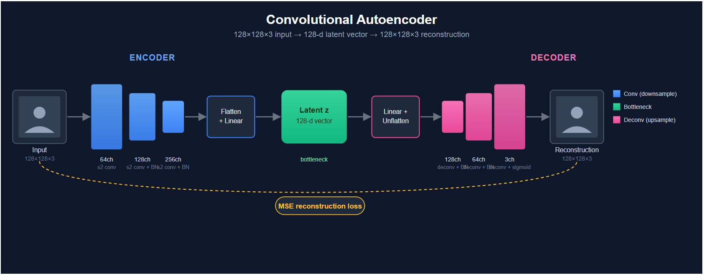

# AE-CelebA-Faces 🧑‍🦰


> **Results at a glance:** Trained **40 epochs** on a Colab **T4** GPU · Convolutional
> autoencoder (128-dim latent) · Checkpoint + resume support across sessions · Fixed sample
> image tracked for a consistent epoch-by-epoch reconstruction comparison

A convolutional **autoencoder** (deterministic latent vector, reconstruction loss only — no
KL term, no sampling) trained from scratch on the [CelebA](https://mmlab.ie.cuhk.edu.hk/projects/CelebA.html)
face dataset, learning to compress 128×128 face images down to a 128-dimensional latent
vector and reconstruct them. Training can be paused and resumed across multiple sessions
using full checkpointing (model + optimizer state + loss history), and the same held-out
sample image is used for every comparison so reconstruction quality is directly comparable
across epochs.

## Results

| Epoch 1 | Epoch 20 | Epoch 40 |
|:---:|:---:|:---:|
|  |  |  |



## Architecture



- **Encoder** — 3 strided convolutions (64 → 128 → 256 channels, stride 2 each) with batch
  norm + ReLU, flattened and projected to a 128-dim latent vector with a linear layer.
- **Decoder** — mirrors the encoder: a linear layer back up to the feature map size,
  followed by 3 transposed convolutions (256 → 128 → 64 → 3 channels) with batch norm +
  ReLU, and a final sigmoid to produce pixel values in `[0, 1]`.
- **Loss** — pixel-wise MSE between input and reconstruction. Optimized with Adam.

## Dataset

Images are streamed from the [`nielsr/CelebA-faces`](https://huggingface.co/datasets/nielsr/CelebA-faces)
mirror on the Hugging Face Hub via the `datasets` library — no Kaggle account, API token,
or manual upload required. By default the notebook downloads 5,000 images; set
`NUM_FALLBACK_IMAGES = None` to pull the full ~202k image dataset.

> CelebA is released for **non-commercial research use only**.

## Getting started

1. Open [`face_autoencoder_celeba.ipynb`](face_autoencoder_celeba.ipynb) in
   [Google Colab](https://colab.research.google.com/).
2. **Runtime → Change runtime type → GPU** (T4 is enough).
3. Run the cells top to bottom. First run downloads the dataset subset (a couple of
   minutes); later runs in the same session reuse the cached files.

### Running locally

```bash
git clone https://github.com/Morteza-Asadi-Shalmaiy/AE-CelebA-Faces.git
cd AE-CelebA-Faces
pip install -r requirements.txt
jupyter notebook face_autoencoder_celeba.ipynb
```

## Checkpointing & resuming

Every epoch saves `model_state_dict`, `optimizer_state_dict`, the current epoch, and the
full loss history to `autoencoder_checkpoint.pth`. To continue training later (e.g. after a
Colab runtime disconnect), re-run the training cell with a higher `EPOCHS` and `resume=True`
— it picks up exactly where it left off. Point `CHECKPOINT_PATH` at a Google Drive path if
you want checkpoints to survive a runtime reset.

## Repo structure

```
.
├── face_autoencoder_celeba.ipynb   # main notebook — data, model, training, resume
├── assets/                         # sample outputs used in this README
├── requirements.txt
├── LICENSE
└── .gitignore
```

## License

Released under the [MIT License](LICENSE). Note that the underlying CelebA dataset has its
own non-commercial research-use terms, separate from this code's license.
